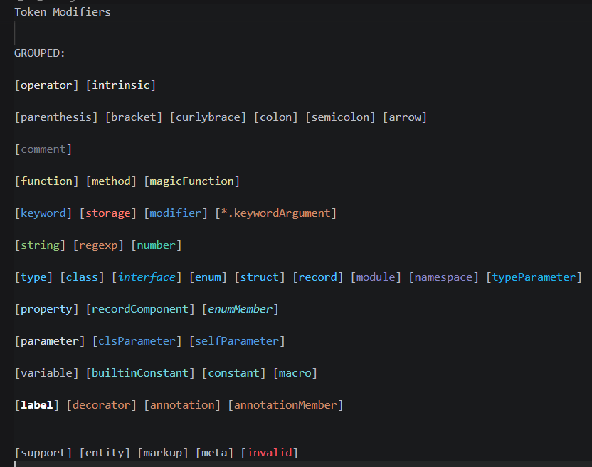
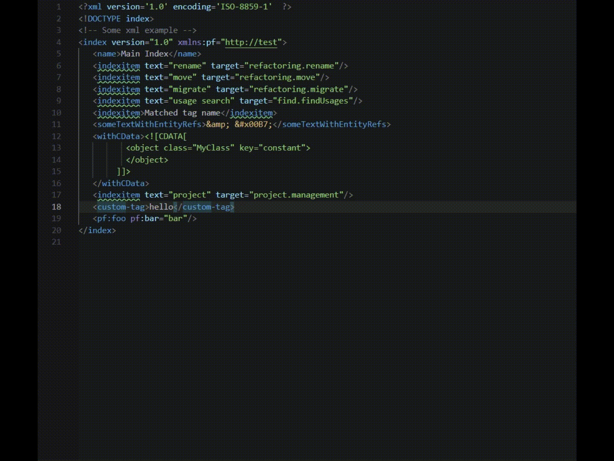

# VS Code: Settings IDE v1 - Color Theme

Settings IDE v1 - Color Theme is a Visual Studio Code extension that provides a custom, handmade color theme for the syntax highlighting of the IDE.

Each color has been carefully handpicked to build something which satisfies the 3 main necessities of a good dark color theme: **Visual Appeal**, **Readability**, **Eye-Comfort**.

The theme uses VS Code's `Dark 2026` as the IDE theme, while the most important colors of the editor, and basically all colors for the syntax highlighting, have been customized.

## Extension Showcase

### Theme Color Palette Showcase

### Main Colors Summary

| TOKEN       |           |  | VARIATION |           |  |
| ----------- | ---------  | - | --------- | --------- |  -  |
| default     | `#BCBEC4` |   |	operator  | `#E3E3E3` |  |
| variable    |	`#BCBEC4` |   | parameter | `#DCDCDC` |  |
| comment     |	`#7A7E85` |   |           | | |
| property    |	`#9CDCFE` |   |          | | |
| type/class  |	`#4FC1FF` |   |interface | `#1FB2E9` |  |
| keyword     |	`#569CD6` |   |          | | |
| number      |	`#4EC9B0` |   |constant  | `#79D3DB` |  |
| string      |	`#98C379` |   |           | | |
| doc-comment |	`#5F826B` |   |           | | |
| fun-call    |	`#DCDCAA` |   | fun-decl  | `#EED18C` |  |
| annotation  |	`#CF8E6D` |   |           | | |
| keyw-flow   |	`#C586C0` |   |           | | |
| ----------- | --------- | --- | ---------- | ---------- | --- |
| escape char |	`#D7BA7D` |   |           | | |

### Theme Syntax Highlighting Showcase

**Python:**

**Java:**

**C/C++:**

**JavaScript:**

**HTML:**

**CSS:**

**JSON:**

**XML:**

**Markdown:**

## Check out more from the Setting IDE Series

- **Settings IDE v1 - Keymap** --> [GitHub](https://github.com/filippochinni/vs-code-settings-ide-v1-keymap) | [VS Code Marketplace](https://marketplace.visualstudio.com/items?itemName=filippochinni.settings-ide-v1---keymap)

My Extensions Publisher Profile: [Marketplace Publishers](https://marketplace.visualstudio.com/publishers/filippochinni)

<!-- <a href="https://www.flaticon.com/free-icons/source-code" title="source code icons">Source code icons created by Prosymbols Premium - Flaticon</a> -->
