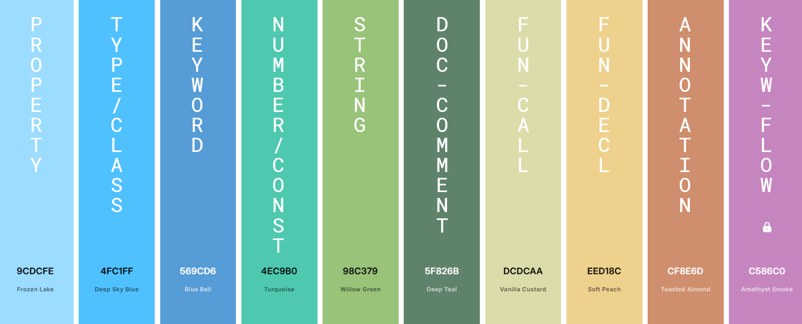

# VS Code: Settings IDE v1 - Color Theme

Settings IDE v1 - Color Theme is a Visual Studio Code extension that provides a custom, handmade color theme for the syntax highlighting of the IDE.

Each color has been carefully handpicked to build something which satisfies the 3 main necessities of a good dark color theme: **Visual Appeal**, **Readability**, **Eye-Comfort**.

The theme uses VS Code's `Dark 2026` as the IDE theme, while the most important colors of the editor, and basically all colors for the syntax highlighting, have been customized.

## Extension Showcase

### Theme Color Palette Showcase

### Main Colors Summary

| TOKEN       |           | VARIATION |           |
| ----------- | --------- | --------- | --------- |
| default     | #BCBEC4 |	operator  | #E3E3E3 |
| variable    |	#BCBEC4 | parameter | #DCDCDC |
| comment     |	#7A7E85 |           | |
| property    |	#9CDCFE |           | |
| type/class  |	#4FC1FF | interface | #1FB2E9 |
| keyword     |	#569CD6 |           | |
| number      |	#4EC9B0 | constant  | #79D3DB |
| string      |	#98C379 |           | |
| doc-comment |	#5F826B |           | |
| fun-call    |	#DCDCAA | fun-decl  | #EED18C |
| annotation  |	#CF8E6D |           | |
| keyw-flow   |	#C586C0 |           | |
| ----------- | --------- | --------- | ---------- |
| escape char |	#D7BA7D |           |            |

### Theme Syntax Highlighting Showcase

**Python:**

**Java:**

**JavaScript:**

**HTML:**

**CSS:**

**JSON:**

**XML:**

**Regex:**

**Markdown:**

## Check out more from the Setting IDE series

-
